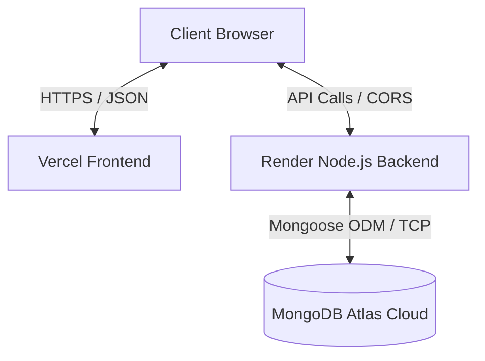

# CSE5 Row Rotation Table — Project & Deployment Documentation

This document provides a comprehensive overview of the technologies, architecture, and deployment procedures used for the **Row Rotation Table (RRT)** web application.

---

## 1. Technology Stack

### Frontend (User Interface)
* **Framework:** React (V19) with Vite (V6) for rapid, optimized static builds.
* **Routing:** `react-router-dom` (V7) for client-side routing (Student View vs. Admin Panel).
* **Styling:** Tailwind CSS (V4) for a responsive, modern, and clean design system.
* **HTTP Client:** Axios for making API requests to the backend.

### Backend (API Server)
* **Runtime:** Node.js
* **Framework:** Express.js (V4) for routing and middleware management.
* **Database Driver:** Mongoose (V8) for object data modeling (ODM) with MongoDB.
* **Security Middleware:** CORS (Cross-Origin Resource Sharing) configured to restrict origins dynamically based on environmental variables.

### Database (Data Persistence)
* **Database Engine:** MongoDB Atlas (Cloud Cluster, Free M0 tier).
* **Data Model:** A single state document (`app_state`) that stores current day, announcement, leave days, custom overrides, and the admin authentication PIN.

---

## 2. System Architecture

* **Frontend Hosting:** Vercel serves the compiled static React build.
* **Backend API Hosting:** Render runs the Node.js server in a Docker-like container environment.
* **Database:** MongoDB Atlas hosts the data in a secure, managed cloud database cluster.

---

## 3. Environment Variables & Configurations

### Backend Environment Variables (Set on Render)
* `MONGO_URI`: The MongoDB Atlas connection string.
* `FRONTEND_URL`: `https://row-rotation-table.vercel.app` (restricts CORS access strictly to this domain).
* `ADMIN_PIN`: The secure password required to access the admin panel.
* `PORT`: Configured by Render automatically (defaults to `5000` locally).

### Frontend Environment Variables (Set on Vercel)
* `VITE_API_URL`: `https://row-rotation-table.onrender.com/api` (tells Axios where to send API requests).

---

## 4. Hosting Lifetimes & Limits

### Vercel Link (Frontend)
* **Duration:** **Active Indefinitely.** Vercel free hobby plans do not expire.
* **Limits:** You get 100 GB of free bandwidth per month, which is more than enough to handle thousands of student visits daily.

### Render Link (Backend)
* **Duration:** **Active Indefinitely.** The API URL will never expire.
* **Free Tier Caveat (Spin-down):** Render's free web services will "sleep" (spin down) after 15 minutes of inactivity. When a student visits the site after it has slept, the first request will trigger a "wake-up" which takes about **30 to 50 seconds** to boot. Subscribing to a Render paid tier ($7/month) or using a free pinging service (like UptimeRobot) to ping `https://row-rotation-table.onrender.com/api/health` every 10 minutes keeps the server awake.
